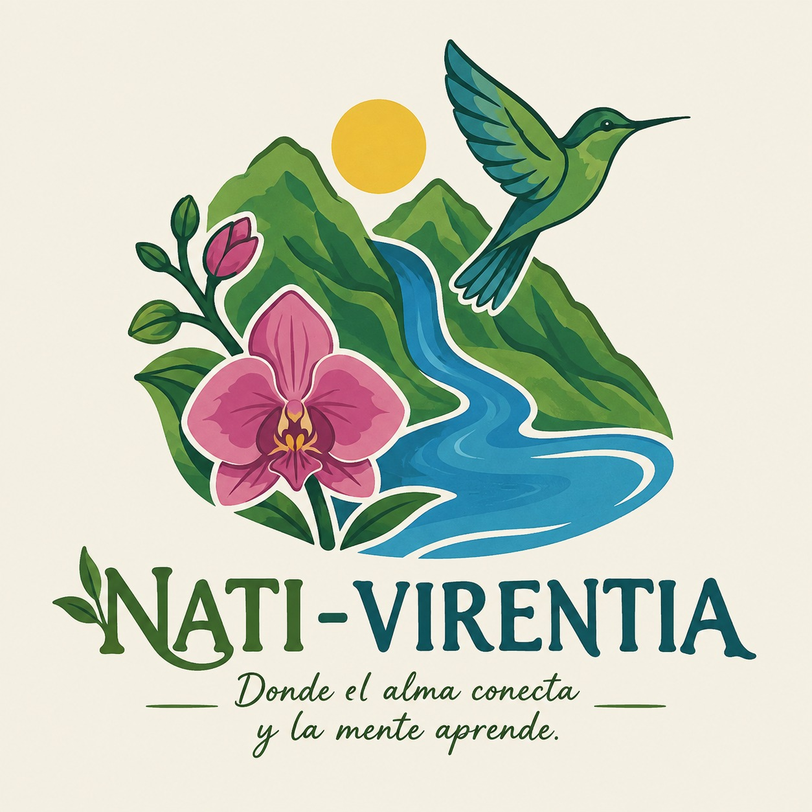

NATIVIRENTIA

Donde el alma conecta y la mente aprende

Documento de identidad visual, estructura, contenido y funcionalidades de la plataforma web

1. Descripción general de Nativirentia

Nativirentia es una plataforma digital enfocada en el ecoturismo, el conocimiento de la biodiversidad vegetal y la valoración de las plantas nativas de Colombia. La propuesta busca conectar a las personas con los ecosistemas colombianos mediante una experiencia que combine aprendizaje, exploración y contacto con la naturaleza.

La plataforma integra dos componentes principales:

Conocimiento de plantas nativas: catálogo digital para explorar especies, características, distribución, importancia ecológica y otros datos relevantes.

Experiencias de ecoturismo: sección para conocer recorridos y caminatas en espacios naturales, con información sobre ecosistemas y especies que pueden encontrarse durante cada experiencia.

La propuesta busca que la visita a un espacio natural no sea solamente una actividad turística, sino también una experiencia de aprendizaje, conexión con la naturaleza y reconocimiento de la biodiversidad colombiana.

2. Identidad de marca

2.1. Nombre

NATIVIRENTIA

El nombre debe aparecer de manera destacada y funcionar como el principal elemento de identificación de la plataforma. La identidad gráfica debe transmitir naturaleza, biodiversidad, Colombia, exploración, aprendizaje, conservación, tranquilidad y conexión emocional con los ecosistemas.

2.2. Slogan

“Donde el alma conecta y la mente aprende”

El slogan representa dos dimensiones de la propuesta:

Alma conecta: representa la experiencia emocional, sensorial y de conexión con la naturaleza.

Mente aprende: representa el componente educativo mediante el conocimiento de plantas nativas, ecosistemas y conservación.

3. Paleta de colores

3.1. Verde — naturaleza y conservación

El verde será uno de los colores principales de la identidad. Representa naturaleza, biodiversidad, conservación, sostenibilidad y vida.

Usos: botones principales, encabezados, menú, tarjetas de plantas, íconos y elementos relacionados con naturaleza. Se pueden manejar verde oscuro, verde medio y verde claro para crear jerarquía.

3.2. Azul — agua y tranquilidad

Representa agua, ríos, lagos, ecosistemas acuáticos, tranquilidad, confianza, equilibrio y serenidad.

Usos: secciones relacionadas con ríos, cascadas, lagos, recorridos y reservas, además de detalles de interfaz para generar contraste con el verde.

3.3. Rosado — flora y sensibilidad

Representa flores, orquídeas, belleza natural, diversidad vegetal, delicadeza, calidez y conexión emocional. Debe funcionar principalmente como color de acento.

3.4. Amarillo — sol y exploración

Representa sol, energía, vitalidad, calidez, alegría, exploración y descubrimiento. Puede destacar experiencias, información importante, íconos y llamados a la acción.

3.5. Blanco — limpieza y equilibrio

Será el tono neutro de fondo. Representa limpieza, transparencia, aire, espacio y claridad. Permitirá que los colores naturales y las fotografías tengan protagonismo.

4. Tipografía de Nativirentia

La identidad tipográfica debe ser natural, elegante, cercana y fácil de leer. Como la plataforma tendrá contenido educativo, información científica y datos de recorridos, se propone diferenciar la tipografía de identidad de la tipografía de interfaz.

4.1. Tipografía del logotipo

El logotipo utilizará una tipografía Serif / Incisa de estilo orgánico y personalizado, con remates orgánicos, curvas suaves, apariencia artesanal y detalles inspirados en formas botánicas. Puede incorporar una terminación en forma de hoja en la letra N.

Esta tipografía será exclusiva del logotipo y no se recomienda para textos largos.

4.2. Tipografía del slogan

Para “Donde el alma conecta y la mente aprende” se propone Great Vibes o Allura. Se utilizará en el slogan, frases inspiradoras, mensajes destacados y algunos elementos decorativos.

La tipografía manuscrita debe utilizarse de forma puntual para no afectar la legibilidad.

4.3. Tipografía general de toda la página

Se recomienda Poppins como tipografía principal de toda la interfaz. Es limpia, moderna, juvenil, amigable y fácil de leer, y funciona bien en computador y dispositivos móviles.

4.4. Jerarquía tipográfica

| Elemento | Tipografía / uso |
| --- | --- |
| Títulos principales | Poppins Bold / 700 — títulos de páginas, secciones, especies y experiencias. |
| Subtítulos | Poppins SemiBold / 600 — categorías, encabezados de tarjetas y secciones. |
| Texto normal | Poppins Regular / 400 — descripciones, información científica, recorridos y artículos. |
| Datos destacados | Poppins Medium / 500 — precio, duración, ubicación, dificultad y etiquetas. |
| Botones | Poppins SemiBold / 600 — Explorar, Conocer más, Ver recorrido, Reservar, Crear cuenta. |
| Nombres científicos | Poppins Italic — nombres científicos de las especies. |
| Formularios | Poppins Regular/Medium — campos, etiquetas y datos ingresados. |
| Comunidad | Poppins Regular/Medium — usuarios, reseñas, fechas y comentarios. |
| Frases especiales | Great Vibes o Allura — mensajes emocionales puntuales. |

Regla general: “La personalidad está en la marca; la claridad está en la información”. Por tanto, el logotipo y slogan aportan personalidad, mientras Poppins mantiene la claridad en toda la interfaz.

5. Concepto visual del logotipo

El logotipo debe integrar tres elementos principales: colibrí, río y vegetación.

Colibrí: biodiversidad, movimiento, vida, libertad y polinización.

Río: agua, movimiento, conexión entre territorios y vida.

Vegetación: biodiversidad vegetal y especies nativas.

5.1. Animación del logotipo

La página de inicio puede incorporar una animación suave para dar sensación de vida. El colibrí puede mover ligeramente sus alas o desplazarse; el río puede simular movimiento del agua; y las hojas pueden moverse sutilmente como si hubiera viento.

La animación debe ser corta, ligera y no distraer. Debe existir también una versión estática para menú, redes sociales, documentos y otros usos.

6. Estructura general de la página

La navegación principal propuesta es:

Inicio

Plantas nativas

Explora Colombia

Caminatas

Aprende

Comunidad

Iniciar sesión / Mi cuenta

El encabezado debe incluir el logo, el menú y un botón destacado como “Explorar”.

7. Página de inicio

7.1. Hero o sección principal

La primera pantalla debe utilizar una fotografía o video de un paisaje natural colombiano: bosques, montañas, ríos, cascadas, páramos, selvas o vegetación nativa.

Sobre la imagen o video aparecerán:

NATIVIRENTIA

Donde el alma conecta y la mente aprende

Botón: Explorar la naturaleza

Botón: Descubrir plantas

7.2. Descubre nuestras plantas

Se mostrarán tarjetas con fotografía, nombre común, nombre científico, región, tipo de planta, ecosistema y botón “Conocer más”.

8. Catálogo de plantas nativas

La primera versión puede incluir especies representativas de distintos ecosistemas colombianos. La selección definitiva debe verificarse con fuentes botánicas confiables, especialmente en cuanto a condición de nativa, distribución y estado de conservación.

| Especie  /  grupo | Descripción |
| --- | --- |
| Cattleya  trianae | Flor de mayo; orquídea emblemática de Colombia. |
| Ceroxylon   quindiuense | Palma de cera; especie característica de ambientes andinos. |
| Guayacán | Representante de especies arbóreas tropicales; la especie concreta debe definirse. |
| Espeletia  spp. | Frailejones; grupo representativo de los páramos. |
| Heliconia spp. | Plantas tropicales de importancia para diferentes organismos. |
| Cecropia spp. | Yarumos; asociados  a  ecosistemas tropicales y procesos de regeneración. |
| Ceiba pentandra | Árbol de gran tamaño asociado  a  ecosistemas tropicales. |
| Guadua  angustifolia | Bambú de importancia ecológica, cultural y constructiva. |
| Bromeliaceae | Familia de plantas representativa de diferentes ambientes tropicales. |
| Clusia  spp. | Chagualos; grupo asociado principalmente a ambientes andinos. |

9. Interfaz individual de cada planta

Al seleccionar una planta se abrirá una interfaz con información ampliada.

Fotografía principal.

Nombre común y nombre científico.

Familia.

Distribución.

Ecosistema.

Altitud aproximada.

Características.

Época de floración, cuando corresponda.

Importancia ecológica.

Mapa de Colombia con distribución registrada.

Curiosidades o sección “¿Sabías que...?”.

Galería de fotografías y videos.

Experiencias relacionadas.

La ficha debe conectar la especie con experiencias de ecoturismo: “¿Quieres conocer su ecosistema?” → “Explorar caminatas”.

10. Buscador y filtros

El buscador permitirá encontrar especies por nombre común o científico. También puede incorporar búsqueda por región, ecosistema, tipo de planta, color o características.

Filtros sugeridos:

Páramo

Bosque andino

Bosque seco

Selva tropical

Humedal

Manglar

Bosque de niebla

Caribe

Pacífica

Andina

Orinoquía

Amazonía

Árbol

Arbusto

Hierba

Orquídea

Palma

Helecho

Bromelia

Bambú

11. Explora Colombia

Esta sección utilizará un mapa interactivo de Colombia. El usuario podrá seleccionar regiones y visualizar ecosistemas, plantas, caminatas, áreas naturales y experiencias.

Ejemplo de navegación: Región Andina → Páramos → Frailejones → Caminatas disponibles.

12. Caminatas y experiencias de ecoturismo

Cada experiencia aparecerá como una tarjeta con:

Imagen.

Nombre del recorrido.

Departamento y municipio.

Duración.

Dificultad.

Precio aproximado.

Tipo de ecosistema.

Especies que pueden observarse.

Calificación de usuarios.

Botón “Ver recorrido”.

12.1. Lugares que podrían aparecer

| Lugar | Ubicación | Experiencia | Precio de referencia |
| --- | --- | --- | --- |
| Páramo de  Sumapaz | Cundinamarca / Bogotá | Caminata de interpretación de páramo. | $50.000–$150.000 COP como referencia para experiencias guiadas; depende del operador y servicios. |
| Valle de  Cocora | Quindío | Paisajes de bosque andino y palma de cera. | $20.000–$150.000 COP como referencia, dependiendo de acceso, guía y servicios. |
| Parque Nacional Natural  Chingaza | Cundinamarca / Meta | Interpretación de ecosistemas de alta montaña. | Variable según recorrido y operador autorizado. |
| Parque Nacional Natural Los  Nevados | Cordillera Central | Exploración de ecosistemas de alta montaña. | Variable según operador, transporte, guía y duración. |
| Jardín  Botánico  del Quindío | Quindío | Interpretación de biodiversidad vegetal. | Consultar tarifa vigente antes de publicar. |
| Amazonía   colombiana | Amazonas | Recorridos de interpretación de selva y biodiversidad. | Variable según duración, alojamiento, transporte y operador. |

Los precios deben identificarse como precios de referencia y actualizarse periódicamente. No deben presentarse como tarifas oficiales. Se recomienda mostrar “Desde $XX.XXX COP” y aclarar que pueden variar según operador, temporada y servicios incluidos.

13. Página detallada de cada caminata

Nombre del recorrido.

Ubicación: departamento y municipio.

Mapa o ubicación aproximada.

Duración.

Dificultad: baja, media o alta.

Distancia.

Ecosistema.

Especies que podrían observarse.

Precio.

Qué incluye: guía, seguro, entrada, transporte, alimentación, según corresponda.

Recomendaciones de seguridad y comportamiento ambiental.

Entre las recomendaciones: llevar agua, utilizar calzado adecuado, llevar protección solar, no extraer plantas, no alimentar animales y permanecer en senderos autorizados.

14. Fotografías y videos

Cada recorrido debe contar con una galería de fotografías del paisaje, plantas y recorrido. También pueden incorporarse videos cortos y videos educativos. En la página principal, un video de naturaleza puede utilizarse como fondo de la sección Hero.

15. Sección Aprende

Esta sección reforzará el componente educativo de la plataforma.

¿Qué es una planta nativa?

¿Por qué son importantes las plantas nativas?

Plantas nativas vs. especies introducidas.

¿Qué es un ecosistema?

¿Por qué conservar la biodiversidad?

¿Qué podemos hacer durante una caminata?

¿Cómo observar plantas sin afectar el ecosistema?

El contenido debe combinar textos cortos, fotografías, infografías, íconos y elementos destacados.

16. Comunidad Nativirentia

Los usuarios registrados podrán compartir fotografías, escribir reseñas, recomendar lugares, compartir observaciones de plantas, comentar experiencias y guardar plantas o caminatas favoritas.

16.1. Aporte de nuevas plantas

El usuario podrá seleccionar “Agregar planta” y enviar nombre, fotografía, ubicación general, descripción, nombre científico si lo conoce y observaciones.

Toda contribución debe pasar por un proceso de revisión antes de aparecer públicamente, especialmente para evitar errores de identificación.

16.2. Reseñas

Después de una experiencia, el usuario podrá dejar una calificación de 1 a 5 estrellas, un comentario y fotografías.

16.3. Perfil

Nombre y fotografía.

Plantas favoritas.

Caminatas realizadas.

Reseñas publicadas.

Fotografías compartidas.

Contribuciones a la comunidad.

Como elemento de gamificación se pueden crear logros como “Explorador de plantas”, “Explorador de ecosistemas”, “Conocedor de biodiversidad” y “Fotógrafo naturalista”.

17. Registro, suscripción y cuenta

La plataforma debe incluir una sección para crear una cuenta. Puede solicitar:

Nombre

Correo electrónico

Contraseña

Ciudad o región

Intereses

La cuenta permitirá participar en la comunidad, aportar especies, publicar reseñas y guardar favoritos. Si posteriormente se implementan servicios externos de inicio de sesión, se pueden añadir como alternativa.

18. Conexión entre plantas y ecoturismo

Una característica diferenciadora será conectar el catálogo botánico con las experiencias de ecoturismo.

La lógica de navegación será:

PLANTA → ECOSISTEMA → LUGAR → CAMINATA → EXPERIENCIA

Por ejemplo, al consultar un frailejón, el usuario puede conocer el ecosistema de páramo y posteriormente visualizar caminatas relacionadas con ese ecosistema.

19. Diseño de la interfaz

El estilo general debe ser natural, moderno, limpio, educativo, cálido, visual y fácil de utilizar. Las fotografías de naturaleza deben tener protagonismo, mientras las tarjetas pueden utilizar bordes redondeados, fondos blancos, detalles verdes y acentos azules, rosados y amarillos.

19.1. Ejemplo de tarjeta

FOTOGRAFÍA → Palma de cera → Ceroxylon quindiuense → Bosque andino → Colombia → [Conocer más]

20. Pie de página

Nativirentia.

“Donde el alma conecta y la mente aprende”.

Sobre nosotros.

Plantas.

Caminatas.

Comunidad.

Aprende.

Contacto.

Términos y condiciones.

Política de privacidad.

Redes sociales.

21. Pantallas recomendadas para el prototipo en Figma

Inicio: logo, slogan, paisaje/video y botones.

Plantas nativas: catálogo de especies.

Información de una planta: ficha ampliada.

Explora Colombia: mapa, ecosistemas, especies y lugares.

Caminatas: catálogo de experiencias.

Información de una caminata: lugar, precio, duración, dificultad y especies.

Aprende: contenido educativo.

Comunidad: publicaciones y reseñas.

Registro / inicio de sesión.

Perfil: favoritos, caminatas y contribuciones.

22. Funciones futuras

Mapa interactivo.

Identificación aproximada de plantas mediante fotografía, como función futura.

Códigos QR en recorridos para consultar información de especies.

Audio-guías.

Descubrimiento de especies cercanas, sujeto a ubicación y condiciones de privacidad.

Sistema de favoritos y recomendaciones personalizadas.

23. Experiencia ideal del usuario

El usuario entra a Nativirentia.

Observa el paisaje y la animación del colibrí y el río.

Lee “Donde el alma conecta y la mente aprende”.

Selecciona “Explorar”.

Elige entre descubrir plantas o explorar lugares.

Encuentra una planta que le interesa.

Lee sobre la especie y conoce el ecosistema donde vive.

La plataforma muestra caminatas relacionadas.

Consulta recorrido, precio, dificultad y especies.

Realiza la experiencia.

Regresa a Nativirentia y comparte fotografías o una reseña.

Su contribución puede ampliar el conocimiento de la comunidad.

24. Concepto general

Nativirentia no debe presentarse únicamente como una página para reservar caminatas. Su propuesta integra naturaleza, educación, ecoturismo, comunidad y conservación.

NATURALEZA → Conocimiento de especies y ecosistemas.

EDUCACIÓN → Información científica presentada de manera sencilla.

ECOTURISMO → Experiencias de contacto directo con los ecosistemas.

COMUNIDAD → Participación y experiencias de los usuarios.

CONSERVACIÓN → Promoción del conocimiento y valoración de la biodiversidad.

La propuesta puede resumirse como:

CONOCER → COMPRENDER → EXPLORAR → VALORAR → CONSERVAR

25. Información que todavía debe definirse

Público objetivo: jóvenes, estudiantes, familias, turistas nacionales, turistas extranjeros u otros grupos.

Alcance geográfico inicial: un departamento, una región, algunas ciudades o todo Colombia.

Modelo de negocio: comisión por reservas, suscripción, publicidad de operadores, venta de experiencias, alianzas u otros.

Sistema de reservas: mostrar información y redirigir al operador, reservar dentro de Nativirentia o pagar directamente.

Proceso de verificación de plantas, fotografías, ubicaciones, información científica y reseñas.

Fuentes científicas que respaldarán la información botánica.

Política de privacidad, tratamiento de fotografías, términos de uso y manejo del contenido generado por usuarios.

Códigos HEX definitivos de la paleta de colores.

Versión final del logo y animación.

Pantallas exactas que se construirán en el prototipo inicial.

26. Arquitectura general de la plataforma

NATIVIRENTIA

Inicio

🌿 Plantas nativas → Catálogo → Buscar → Filtros → Información de cada especie

🗺️ Explora Colombia → Mapa → Regiones → Ecosistemas → Biodiversidad

🥾 Caminatas → Experiencias → Lugares → Precios → Reservas

📚 Aprende → Biodiversidad → Plantas → Ecosistemas → Conservación

🌱 Comunidad → Fotografías → Reseñas → Nuevas plantas → Experiencias

👤 Mi cuenta → Perfil → Favoritos → Mis caminatas → Mis contribuciones

27. Resumen de identidad visual

La identidad visual final propuesta combina una marca orgánica y emocional con una interfaz moderna y legible.

Logotipo: tipografía Serif/Incisa orgánica y personalizada.

Slogan: Great Vibes o Allura.

Interfaz completa: Poppins.

Color principal: verde.

Colores complementarios: azul, rosado y amarillo.

Color neutro: blanco.

Elementos gráficos: colibrí, río y vegetación.

Animación: movimiento sutil del colibrí, agua y hojas.

Estilo: natural, moderno, limpio, educativo, cálido y visual.

| Registro del  Estudiante |
| --- |
| NATI-VIRENTIA  está   dirigida   principalmente  a  jóvenes  y  adultos  entre  los  18 y 45  años ,  ubicados   en  Colombia,  especialmente   en  la  región  de Cundinamarca. La marca busca que cada experiencia genere tanto una conexión emocional como un aprendizaje. Por esta razón, NATI-VIRENTIA no pretende ser únicamente una plataforma para encontrar un lugar turístico, sino un espacio en el que las personas puedan disfrutar de la naturaleza, conocer la biodiversidad  de las plantas nativas  que  nos  rodea y comprender la importancia de conservarla. |
| El nombre seleccionado para el emprendimiento es NATI-VIRENTIA. El nombre busca representar la relación entre la naturaleza y la vida, conceptos que se encuentran directamente relacionados con el propósito del emprendimiento. |
| [ Verificación   como   usuario   en  redes  sociales  y/o  como   dominio  web] |
| Se plantea el uso de un imagotipo, ya que permite combinar un elemento gráfico con el nombre de la marca y utilizar ambos elementos de manera independiente cuando sea necesario. El diseño incorpora elementos relacionados con la naturaleza colombiana, como vegetación, montañas, agua y fauna. Estos componentes representan la biodiversidad y buscan transmitir la sensación de estar en contacto con un entorno natural. |
| Verde:  Representa la naturaleza, la biodiversidad, la conservación, la sostenibilidad y la vida. La elección de este tono permite reforzar la relación directa de la marca con las especies nativas y los ecosistemas colombianos.   Azul:  Transmite tranquilidad, confianza y conexión con los recursos naturales, especialmente con el agua. Asimismo, aporta una sensación de equilibrio y serenidad, alineada con la experiencia de desconexión y aprendizaje que propone la marca.  Rosado:  Evoca la riqueza de la flora colombiana, la delicadeza y la belleza de las especies nativas, como las orquídeas. Aporta un toque cálido, empático y humano que conecta emocionalmente con los usuarios, resaltando el valor estilístico de la biodiversidad vegetal. Amarillo:  Representa el sol, la energía, la vitalidad y la calidez del territorio colombiano. Aporta dinamismo, optimismo y luz a la composición, simbolizando el despertar de la conciencia ambiental y la alegría de explorar espacios naturales. Blanco:  Funciona   como  el tono  neutro  de  fondo   en  la  identidad   gráfica  y  en  la  interfaz  de la  plataforma  web o  móvil .  Representa  la  transparencia , la  limpieza  de  los   entornos  naturales y el  aire  puro de las zonas de  conservación . |
| se tomaron como referentes Viator y  GetYourGuide , plataformas relacionadas con el turismo y la  oferta de experiencias. Viator utiliza principalmente colores fríos y una identidad visual sobria. Su logotipo emplea una tipografía Serif moderna, que transmite profesionalismo, experiencia y confianza. Sus aplicaciones también incorporan formas orgánicas y elementos relacionados con mapas y naturaleza. Por su parte,  GetYourGuide  utiliza colores cálidos y una tipografía Sans-Serif geométrica y moderna. Su identidad tiene un carácter juvenil y digital, con formas redondeadas que generan una apariencia amigable y accesible. Su isotipo incorpora elementos geométricos relacionados con movimiento, ubicación y orientación. NATI-VIRENTIA se diferencia visualmente mediante el uso de verde y azul y un imagotipo inspirado en elementos naturales como la vegetación, las montañas, el agua y la fauna. Mientras los referentes analizados presentan una propuesta más general relacionada con la búsqueda y reserva de experiencias turísticas, NATI-VIRENTIA busca construir una identidad específicamente relacionada con la naturaleza colombiana, las especies nativas, la educación ambiental y la conservación. |
| El eslogan de NATI-VIRENTIA es: “Donde el alma conecta y la mente aprende.” La frase representa la experiencia que la marca quiere generar en sus usuarios. La expresión “el alma conecta” hace referencia al vínculo emocional que puede surgir al entrar en contacto con los paisajes, las especies y los ecosistemas naturales. Por otra parte, “la mente aprende” representa el componente educativo de la propuesta y el conocimiento que el usuario puede adquirir sobre la biodiversidad y su conservación. El eslogan es fácil de comprender y pronunciar y, aunque tiene una extensión mayor que una frase publicitaria corta, mantiene una estructura sencilla y fácil de recordar. Además, utiliza un lenguaje emocional que busca generar identificación con el público y transmitir una experiencia positiva. En cuanto a los cuatro pilares establecidos para el eslogan, la frase presenta brevedad relativa,  pronunciabilidad , recordación y euforia. Su estructura permite comunicar el propósito de NATI-VIRENTIA de una manera emocional, relacionando la experiencia turística con el contacto con la naturaleza y el aprendizaje. |
| Como estrategia de publicidad online se propone desarrollar una campaña principalmente a través de Instagram y Facebook, teniendo en cuenta que son canales apropiados para mostrar visualmente los lugares, especies nativas y experiencias que ofrece NAT I -VIRENTIA. La campaña incluiría publicaciones y videos cortos relacionados con especies nativas colombianas, destinos de naturaleza, experiencias de ecoturismo y contenidos educativos. De esta manera, la publicidad no solamente promocionaría el servicio, sino que también permitiría mostrar el propósito  ambiental de la marca. Para una primera campaña se plantea un presupuesto aproximado de $100.000 COP, destinado a promocionar las publicaciones durante una semana. El principal indicador de éxito sería el aumento del alcance y las interacciones en las publicaciones, además de las visitas al perfil y las consultas realizadas por posibles clientes interesados en conocer las experiencias ofrecidas. |
| Como estrategia offline se propone realizar una activación BTL en espacios universitarios y relacionados con el medio ambiente en Cundinamarca. La actividad estaría enfocada en dar a conocer NATI-VIRENTIA mediante material visual sobre especies nativas colombianas y experiencias de ecoturismo. También podría incluir una dinámica sencilla en la que los participantes identifiquen especies o respondan preguntas relacionadas con la biodiversidad. Se estima un presupuesto inicial de aproximadamente $80.000 COP, destinado principalmente a material impreso y elementos necesarios para la actividad. El éxito de la estrategia se mediría mediante el número de personas participantes, los contactos obtenidos y el número de personas que posteriormente visiten las redes sociales |
| En base a los 3 clientes encuestados se definieron los siguientes factores Nombre de la marca:  El nombre  Nati- Virentia  debe mejorarse, ya que no resulta completamente claro para los clientes lo que se ofrece. Esta duda surge principalmente porque la palabra  “ virentia ”  no es intuitiva ni directa.  Experiencia emocional:  Se evidenció que las emociones que transmite la marca están alineadas con el objetivo del proyecto. Los clientes la relacionaron con sensaciones de paz, tranquilidad, naturaleza, desconexión y curiosidad. Esto refuerza la propuesta de valor, ya que se percibe la marca como un refugio frente a la rutina urbana.  Tipografía e identidad visual:  Los clientes manifestaron disconformidad con la letra cursiva del eslogan, señalando que no conecta con el concepto de la marca. Se recomendó optar por una tipografía más redondeada, geométrica y de fácil lectura digital |

